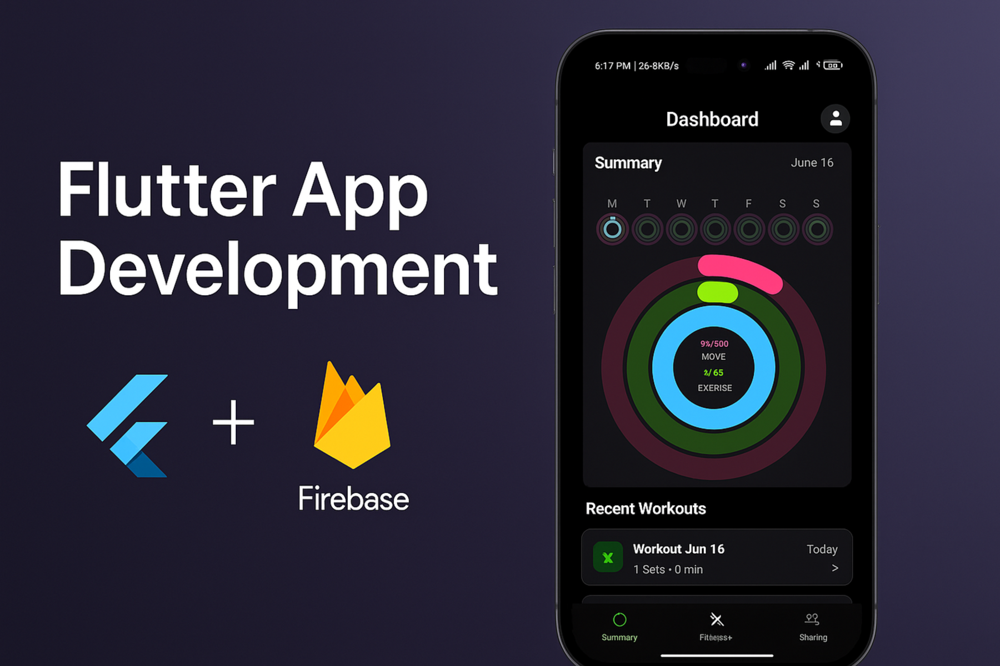
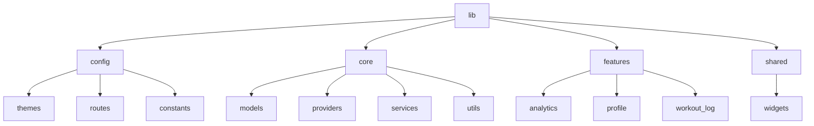
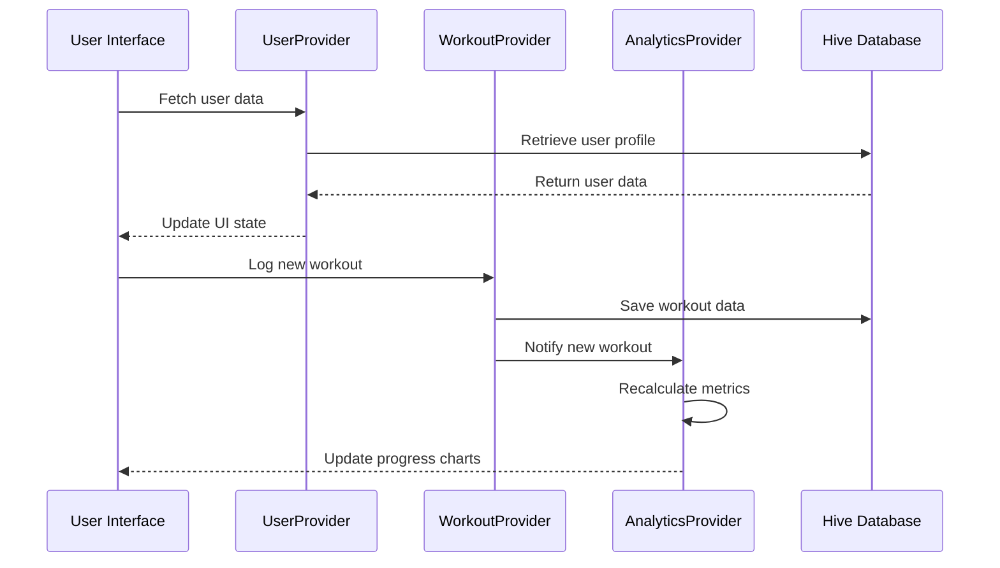

# Workout Tracker Pro 🏋️‍♂️💪🚀

<div align="center">
  
</div>

> Transform your fitness journey with **Workout Tracker Pro** - the ultimate Flutter app to track workouts, monitor progress, and achieve your fitness goals! 💪

## 📱 Featured App Screens

<div align="center">
  <figure>
    
    <figcaption>Home Dashboard</figcaption>
  </figure>
  <figure>
    
    <figcaption>Workout Tracking</figcaption>
  </figure>
  <figure>
    
    <figcaption>Progress Analytics</figcaption>
  </figure>
</div>

## ✨ Key Features

- **👤 Profile Management**
  - 📸 Photo upload from camera/gallery
  - ⚖️ Personal stats tracking (weight, height)
  - 🎯 Fitness goal setting
  - 🔄 Activity level configuration

- **🏋️ Workout Tracking**
  - ✏️ Exercise logging with sets/reps/weight
  - 🛠️ Custom workout creation
  - 📊 Progress visualization with charts

- **💾 Data Management**
  - 📤 Export workout data to Excel
  - 📁 Offline support with Hive database
  - ☁️ Cloud backup integration

- **🌟 Premium Features**
  - 🌙🌞 Dark/light theme support
  - 📤 Share workout data
  - 🔒 Privacy policy integration
  - 📱 Responsive design for all devices


## 🛠️ Technology Stack

- **Framework**: Flutter 3.7+
- **State Management**: Provider 🧩
- **Local Database**: Hive 🗄️
- **Dependencies**:
  - fl_chart (data visualization) 📊
  - image_picker (photo uploads) 📸
  - url_launcher (external links) 🔗
  - share_plus (data sharing) ↗️
  - excel (data export) 💾

## 🚀 Installation

1. **Clone the repository**:
   ```bash
   git clone https://github.com/Kerollosmm/workout-Tracker
   cd workout-tracker-pro
   ```

2. **Install dependencies**:
   ```bash
   flutter pub get
   ```

3. **Run the app**:
   ```bash
   flutter run
   ```

## 🔧 Configuration

1. **Firebase Setup** (optional for cloud features):
   - Add your `google-services.json` to `android/app`
   - Add `GoogleService-Info.plist` to `ios/Runner`

2. **App Icons**:
   ```bash
   flutter pub run flutter_launcher_icons:main
   ```

## 🌳 File Structure Diagram



- 🗂️ **config/**: Global app configurations (themes, routing, constants)
- 🧠 **core/**: Business logic (models, providers, services, utilities)
- 🚀 **features/**: Self-contained feature modules (profile, analytics, workouts)
- ♻️ **shared/**: Reusable components used across multiple features

## 🔄 Provider Workflow Architecture



### Key Providers and Responsibilities:
- 👤 **UserProvider**: Manages user profile and authentication state
- 🏋️ **WorkoutProvider**: Handles workout creation, tracking, and history
- ⚙️ **SettingsProvider**: Manages theme preferences and app configuration
- 📊 **AnalyticsProvider**: Tracks fitness progress and generates insights
- ⏱️ **RestTimerProvider**: Controls rest timers during workouts
- 📅 **HistoryProvider**: Manages workout history and statistics

Providers are initialized in `main.dart`:
```dart
void main() {
  runApp(MultiProvider(
    providers: [
      ChangeNotifierProvider(create: (_) => UserProvider()),
      ChangeNotifierProvider(create: (_) => WorkoutProvider()),
      ChangeNotifierProvider(create: (_) => SettingsProvider()),
      ChangeNotifierProvider(create: (_) => AnalyticsProvider()),
    ],
    child: MyApp(),
  ));
}
```

## 🤝 Contributing

1. Fork the repository
2. Create your feature branch (`git checkout -b feature/AmazingFeature`)
3. Commit your changes (`git commit -m 'Add some AmazingFeature'`)
4. Push to the branch (`git push origin feature/AmazingFeature`)
5. Open a Pull Request

## 📄 License

MIT License - See [LICENSE](LICENSE) for details.

## 📧 Contact

For support or contributions:
- **Support Email**: support@workouttracker.com
- **Personal Contact**: [kerollosmelad94@gmail.com](mailto:kerollosmelad94@gmail.com)
- **GitHub Issues**: [Report Bugs/Features](https://github.com/your-username/workout-tracker-pro/issues)
